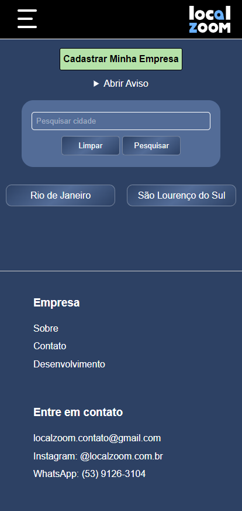
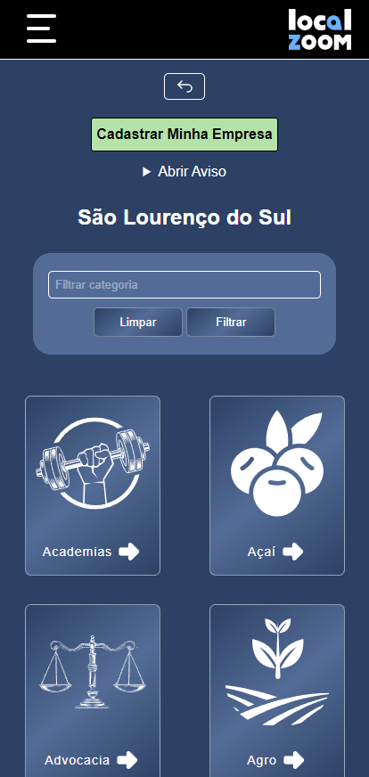
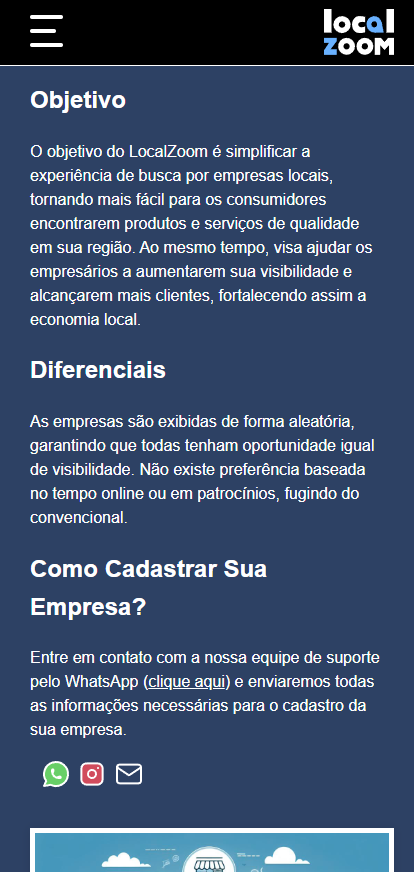
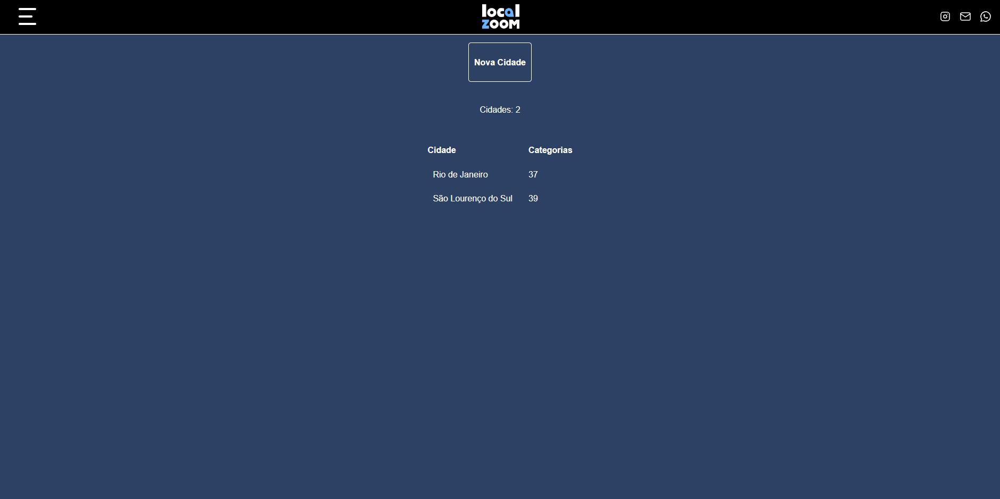
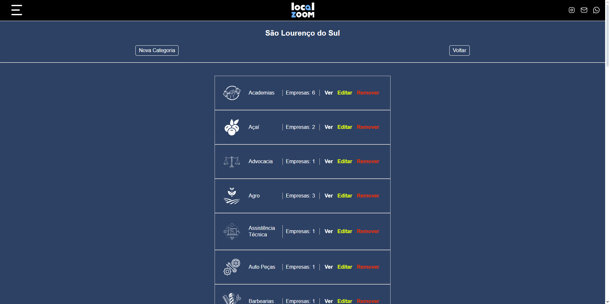
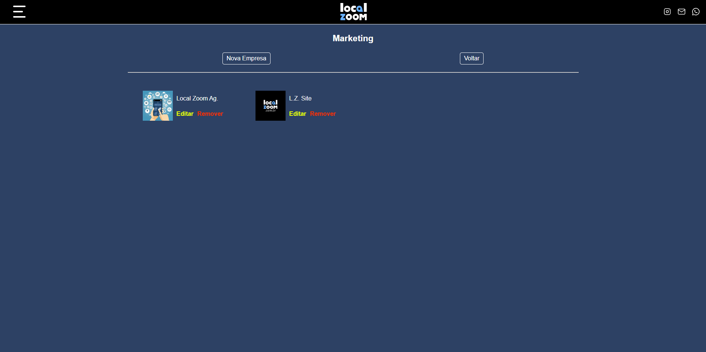
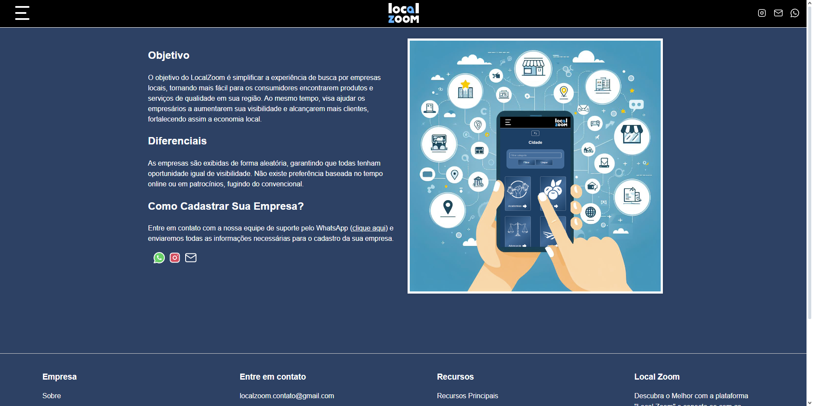

# LocalZoom

Este é o repositório do LocalZoom, uma plataforma desenvolvida para facilitar a busca por produtos e serviços locais. Visite o [LocalZoom](https://localzoom.com.br) para saber mais.

## Tecnologias Utilizadas

- **Backend**: Node.js, Express, MongoDB
- **Frontend**: EJS, CSS

## Descrição do Projeto

O LocalZoom foi desenvolvido como uma solução completa e eficiente para atender às necessidades dos usuários que procuram produtos e serviços locais. Utilizando tecnologias avançadas como Node.js, Express e MongoDB, o projeto oferece uma plataforma robusta e escalável.

### Funcionalidades Principais

- Sistema CRUD eficiente
- Métodos HTTP otimizados para uma API confiável
- Upload de arquivos
- Filtros para cidades, categorias e empresas
- Interface responsiva e atraente
- UX/UI intuitiva

## Demonstração

Aqui estão algumas capturas de tela do projeto:

## Contato

Estou aberto a oportunidades de trabalho e disposto a compartilhar e explicar meu código para aqueles que tenham interesse. Se você tiver alguma dúvida ou quiser saber mais sobre o projeto, não hesite em entrar em contato.
