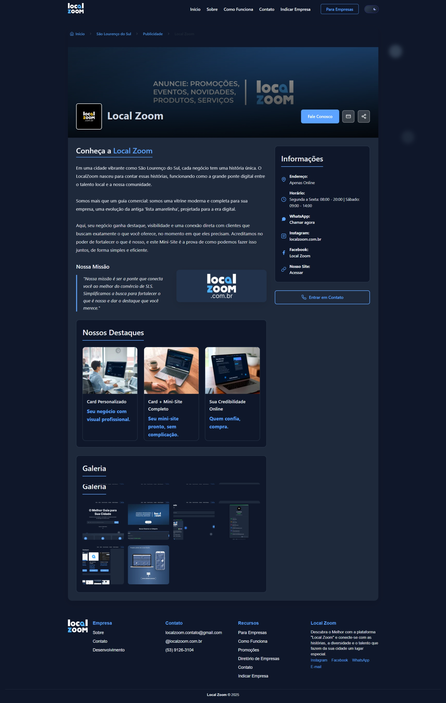
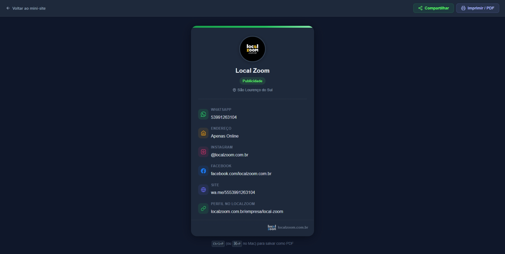
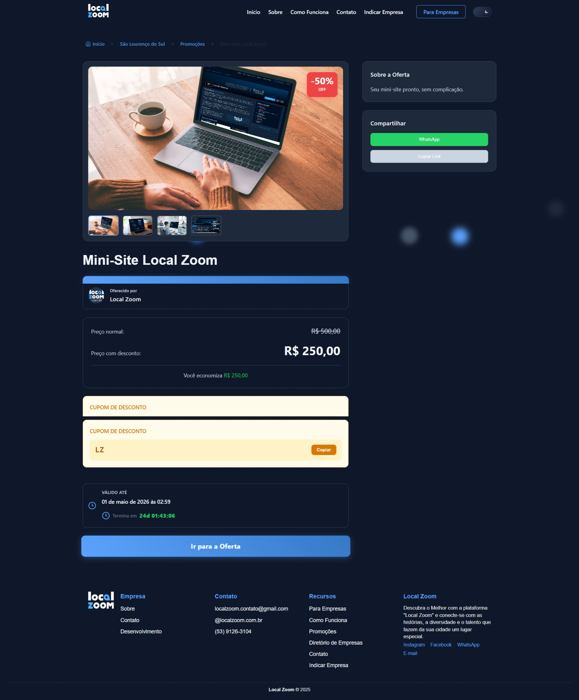
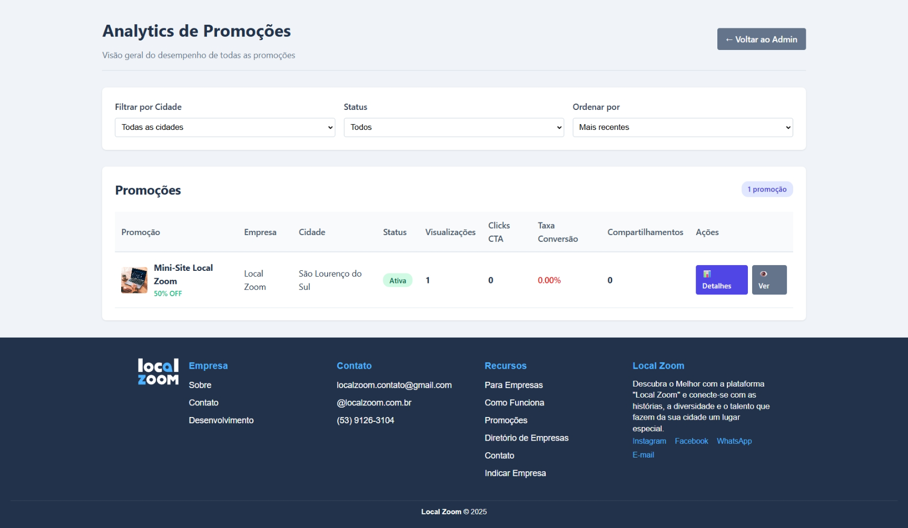
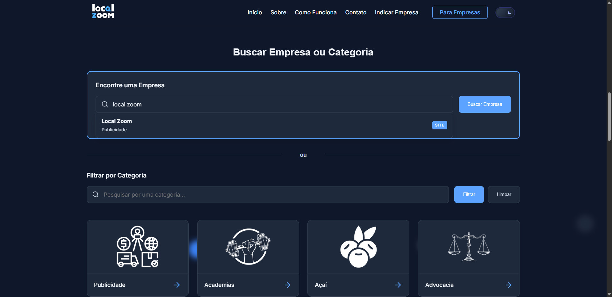
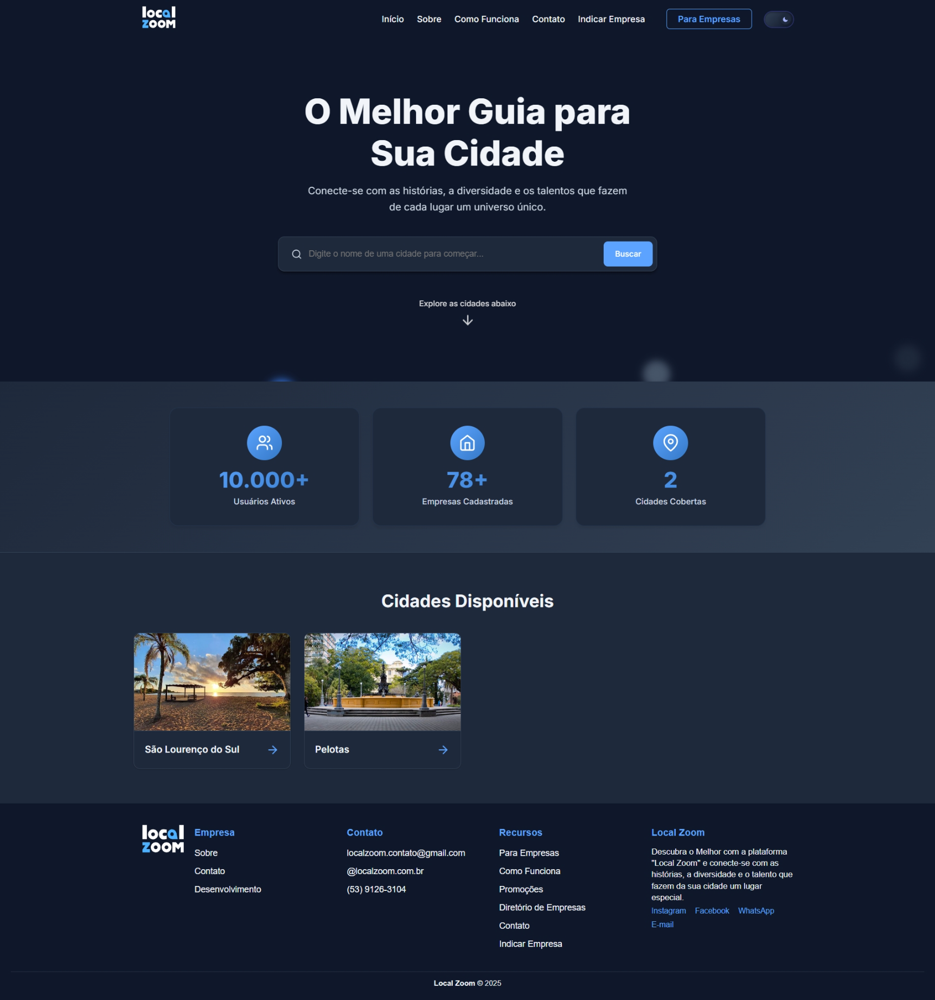

<p align="center">
  
</p>

<h3 align="center">O guia digital inteligente de negócios locais</h3>

<p align="center">
  Conectando moradores, visitantes e empresas — um clique de cada vez.
</p>

<p align="center">
  <a href="https://www.localzoom.com.br">🌐 Acesse o LocalZoom</a>
</p>

---

## Sobre o Projeto

O **LocalZoom** é uma plataforma web que funciona como um diretório digital inteligente de negócios locais — a evolução das antigas "Páginas Amarelas". Desenvolvido do zero por uma única pessoa (arquitetura, backend, frontend, design, deploy e estratégia comercial), o projeto nasceu de um problema real: a dificuldade de encontrar informações organizadas sobre comércios e serviços em cidades pequenas, onde tudo ainda depende de boca a boca e grupos de Facebook.

A plataforma-piloto opera em **São Lourenço do Sul/RS**, com arquitetura multi-cidade preparada para escalar.

### O problema

Em cidades de pequeno e médio porte, encontrar o horário de uma farmácia, o WhatsApp de um eletricista ou as promoções do dia é frustrante. Google é genérico demais, Instagram é desorganizado, grupos de Facebook são caóticos e WhatsApp é efêmero. Nenhuma dessas ferramentas foi desenhada para responder a pergunta mais básica de uma cidade: **"quem faz o quê aqui, e como eu falo com essa pessoa agora?"**

### A solução

O LocalZoom responde isso de forma organizada, bonita e instantânea — direto no navegador, sem app, sem cadastro, sem fricção.

---

## Screenshots

### Site Completo da Empresa (Desktop)

Cada empresa com plano ativo recebe um site completo com descrição, fotos, galeria, horário de funcionamento, endereço, redes sociais e botões de ação rápida (WhatsApp, compartilhar, cartão digital).



### Site Completo da Empresa (Mobile)

Interface 100% responsiva, com experiência otimizada para mobile — onde a maioria dos acessos acontece.


### Cartão de Visita Digital

Gerado automaticamente para cada empresa. Design elegante em dark mode, pronto para compartilhar via WhatsApp ou imprimir.



### Sistema de Promoções com Contador Regressivo

Comerciantes criam ofertas com foto, preço antigo/novo e um timer em tempo real. O cliente vê a urgência — e age.



### Painel de Métricas

O comerciante acompanha acessos ao perfil, cliques no WhatsApp e origem do tráfego. Dados reais, sem achismo.



### Busca Inteligente

Sugestões em tempo real conforme o usuário digita. Resultados filtrados por categoria e cidade.



### Light Mode & Dark Mode

Tema claro e escuro com alternância automática e memória de preferência do usuário.

<p>
  
  
</p>

---

## Funcionalidades

### Para o usuário final (B2C)
- **Busca inteligente** com sugestões em tempo real (search-as-you-type)
- **Diretório unificado** de todas as empresas por cidade e categoria
- **Promoções com contador regressivo** em tempo real
- **Dark Mode global** com memória de preferência
- **100% responsivo** — mobile, tablet e desktop
- **Acessibilidade** — suporte a leitores de tela e navegação por teclado
- **Sem cadastro, sem app** — abre no navegador e usa

### Para o comerciante (B2B)
- **Site completo da empresa** — perfil com fotos, galeria, contatos, horários e botões de ação
- **Cartão de visita digital** — pronto para compartilhar via WhatsApp
- **Painel de métricas** — acessos, cliques no WhatsApp e origem do tráfego
- **Criação de promoções** — sistema self-service com upload de imagem e timer configurável
- **Selo de verificação** — perfil verificado para empresas com plano ativo

### Técnicas e de plataforma
- **Autenticação JWT** com controle de permissões multi-nível
- **SEO otimizado** — meta tags dinâmicas, sitemap automático, URLs semânticas, Schema.org
- **Performance** — lazy loading, minificação de assets, cache inteligente
- **Upload de imagens** com redimensionamento e compressão server-side
- **Arquitetura multi-cidade** — preparada para expansão geográfica

---

## Stack Técnica

| Camada | Tecnologias |
|---|---|
| **Backend** | Node.js, Express.js, MongoDB Atlas, Mongoose, JWT, Multer |
| **Frontend** | EJS (SSR), CSS puro (design system próprio), JavaScript vanilla |
| **Infra & Deploy** | Vercel (deploy contínuo via Git), MongoDB Atlas (cloud) |
| **Em desenvolvimento** | Evolution API + n8n + Claude API (Anthropic) — agente autônomo de vendas via WhatsApp |

---

## Arquitetura

```
┌──────────────────────────────────────────────────────────┐
│                    CLIENTE (Browser)                      │
└────────────────────────┬─────────────────────────────────┘
                         │ HTTPS
                         ▼
┌──────────────────────────────────────────────────────────┐
│                   VERCEL (CDN + Edge)                     │
│                 Deploy contínuo via Git                    │
└────────────────────────┬─────────────────────────────────┘
                         │
                         ▼
┌──────────────────────────────────────────────────────────┐
│                   EXPRESS.JS SERVER                       │
│                                                           │
│   Routes ─── Middlewares ─── Controllers ─── EJS (SSR)    │
│   (API + Pages)  (Auth, Upload,    (Empresas, Promoções,  │
│                   Validation,       Métricas, Usuários)    │
│                   Rate Limit)                              │
└────────────────────────┬─────────────────────────────────┘
                         │
                         ▼
┌──────────────────────────────────────────────────────────┐
│                  MONGODB ATLAS (Cloud)                     │
│                                                           │
│   empresas · promoções · usuários · métricas · cidades    │
└──────────────────────────────────────────────────────────┘

┌──────────────────────────────────────────────────────────┐
│            AUTOMAÇÃO WhatsApp (em desenvolvimento)         │
│                                                           │
│   Evolution API ──▶ n8n ──▶ Claude API (Anthropic)        │
│   (Conexão WA)    (Fluxos)  (Agente autônomo de vendas)   │
└──────────────────────────────────────────────────────────┘
```

---

## Decisões Técnicas

**Por que EJS e não React/Next.js?**
SEO e performance. O LocalZoom depende de tráfego orgânico — moradores buscando "eletricista em São Lourenço do Sul" precisam encontrar a plataforma no Google. Server-Side Rendering com EJS garante indexação completa desde o primeiro request, sem overhead de hidratação de SPA. Para um diretório com conteúdo majoritariamente estático, SSR puro é mais performático e simples de manter.

**Por que CSS puro?**
Controle total sobre o design system. A identidade visual do LocalZoom (dark mode como padrão, paleta azul escuro #21324A / vibrante #4DB1FF) exigiria customização pesada em qualquer framework. CSS puro garante pixel-accuracy, bundles menores e zero conflito de especificidade.

**Por que MongoDB?**
Flexibilidade de schema. Empresas de categorias diferentes têm campos diferentes (restaurante tem cardápio, médico tem especialidade, loja tem catálogo). Document-based storage permite schemas flexíveis sem migrations complexas.

---

## Modelo de Negócio

O LocalZoom opera com modelo **freemium**:

| Plano | Inclui | Valor |
|---|---|---|
| **Listagem gratuita** | Cadastro básico no diretório | Grátis |
| **Card Personalizado** | Perfil verificado + cartão de visita digital + métricas | R$ 150/ano |
| **Card + Site** | Tudo do Card + site completo com fotos, galeria e destaques | R$ 250/ano |

---

## Roadmap

- [x] Diretório com busca inteligente e perfis de empresas
- [x] Sistema de promoções com contador regressivo
- [x] Cartão de visita digital
- [x] Painel de métricas para comerciantes
- [x] Dark mode global com memória
- [x] SEO otimizado (meta tags dinâmicas, sitemap, Schema.org)
- [x] Arquitetura multi-cidade
- [ ] Agente autônomo de vendas via WhatsApp (Evolution API + n8n + Claude API)
- [ ] Progressive Web App (PWA)
- [ ] Dashboard analytics avançado
- [ ] API pública para integrações

---

## Sobre o Código

Este repositório contém o README e screenshots para fins de portfólio. O código-fonte é proprietário e não está disponível publicamente.

**Quer saber mais sobre a arquitetura, estrutura do projeto ou decisões técnicas?** Entre em contato — terei prazer em explicar em detalhes.

---

## Autor

**Brendon Schimmelpfennig da Silva**

Desenvolvedor full-stack e criador do LocalZoom. Único responsável por toda a stack: arquitetura, backend, frontend, design, deploy, vendas e estratégia de marketing.

📍 São Lourenço do Sul, RS — Brasil
🌐 [localzoom.com.br](https://www.localzoom.com.br)

---

<p align="center">
  <strong>LocalZoom</strong> — O melhor guia para sua cidade.
</p>